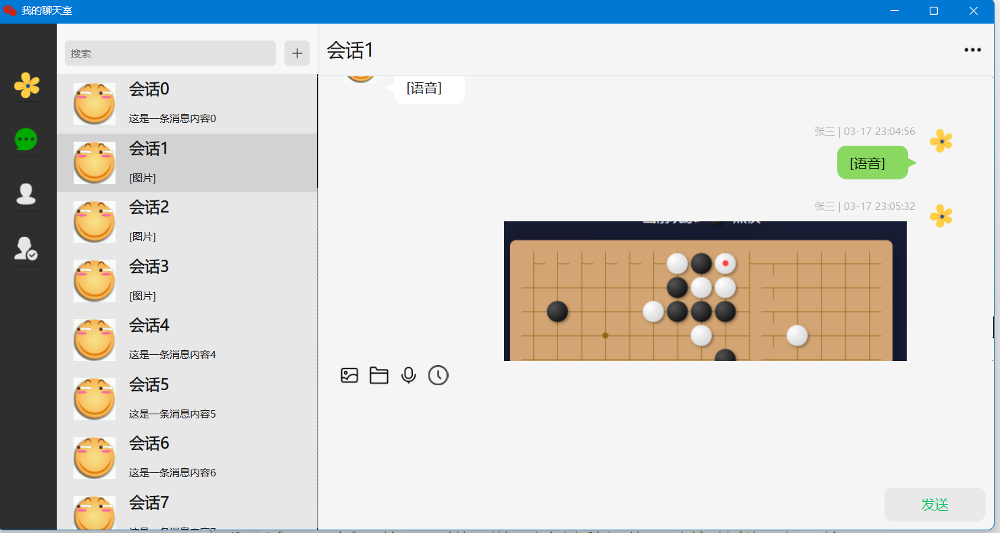

# Qt Instant Messaging System

基于 `C++17 + Qt6 + Protobuf + HTTP/WebSocket + Qt Multimedia` 实现的桌面端即时通讯系统，完整打通了 **登录注册、好友体系、会话管理、历史消息、实时推送、多媒体消息** 的核心链路。

这个项目的重点不只是“做了一个聊天界面”，而是围绕即时通讯客户端的典型架构，搭建了一套可联调、可演示、可扩展的完整系统：**客户端负责状态管理、消息渲染与交互，Mock 服务端负责 HTTP 接口和 WebSocket 推送，通信协议通过 Protobuf 统一定义**。相比纯界面展示类项目，这个项目更能体现我在 **客户端工程分层、网络通信、协议设计、状态管理、多类型消息处理** 方面的理解和实践。



## 项目亮点

- **完整实现 IM 客户端主链路**：支持用户名/密码登录注册、手机号验证码登录注册、个人资料获取与修改、好友搜索、好友申请、创建群聊、消息收发等核心功能。
- **同时覆盖 HTTP 与 WebSocket 两套通信模型**：HTTP 用于请求响应类接口，WebSocket 用于新消息、好友申请、好友处理结果、新建会话等实时通知。
- **基于 Protobuf 统一通信协议**：客户端与服务端共享 `.proto` 文件，避免手写弱约束数据结构，联调成本更低，也更接近真实业务系统。
- **支持多类型消息**：除文本消息外，还支持图片、文件、语音消息，并对文件类消息设计了 `fileId + content` 的二阶段处理方式。
- **支持历史消息检索**：可以按关键词搜索历史消息，也可以按时间范围检索，具备典型 IM 客户端常见的消息回溯能力。
- **具备桌面端状态管理能力**：通过 `DataCenter` 统一管理登录态、好友列表、会话列表、成员列表、最近消息、未读数与搜索结果，避免业务逻辑散落在各个窗口。
- **具备联调闭环**：仓库内提供 `ChatServerMock`，可直接模拟用户信息、好友关系、消息列表、文件获取、语音转文字与 WebSocket 推送流程，便于独立开发与功能验证。

## 技术栈

- `C++17`
- `Qt 6`
- `Qt Widgets`
- `QNetworkAccessManager`
- `QWebSocket`
- `QHttpServer`
- `QWebSocketServer`
- `Qt Protobuf`
- `Qt Multimedia`
- `CMake`

## 项目结构

```text
Qt-Instant-Messaging-System
|
|- ChatClient
|  |- model
|  |  |- data.h
|  |  |- datacenter.h / datacenter.cpp
|  |- network
|  |  |- NetClient.h / NetClient.cpp
|  |- proto
|  |  |- user.proto / friend.proto / notify.proto / ...
|  |- mainwidget / loginwidget / messageshowarea / messageeditarea / ...
|
|- ChatServerMock
|  |- server.h / server.cpp
|  |- widget.ui / widget.cpp
|
|- 项目展示.png
```

## 项目架构

```text
Qt Widgets Client
    |
    |- LoginWidget / PhoneLoginWidget
    |- MainWidget
    |- MessageShowArea / MessageEditArea
    |
    v
DataCenter
    - 登录态管理
    - 用户/好友/会话/消息状态管理
    - 未读消息持久化
    |
    v
NetClient
    - HTTP 请求封装
    - Protobuf 序列化/反序列化
    - WebSocket 连接与通知分发
    |
    +---------------------- HTTP ----------------------+
    |                                                  |
    v                                                  v
ChatServerMock HttpServer                      ChatServerMock WebsocketServer
    - 用户/好友/消息接口                           - 新消息通知
    - 搜索/文件/语音识别接口                        - 好友申请通知
                                                  - 会话创建通知
```

## 核心设计

### 1. 客户端分层与状态中心

项目没有把网络和业务逻辑直接写进界面层，而是抽象出 `DataCenter` 作为状态中心，统一维护：

- 登录会话 `loginSessionId`
- 当前用户信息
- 好友列表
- 会话列表
- 群成员列表
- 最近消息列表
- 未读消息数
- 搜索结果

界面层只负责展示和交互，网络层只负责通信，状态变化通过信号槽同步到 UI，这样在功能扩展时更容易维护。

### 2. HTTP + WebSocket 协同

项目将不同场景拆分为两类链路：

- **HTTP**：登录、注册、获取资料、拉取好友列表、拉取最近消息、搜索历史消息、获取文件内容、语音转文字
- **WebSocket**：实时接收新消息、好友申请、好友申请处理结果、删除好友通知、新会话创建通知

这样既保留了请求响应场景的清晰性，也保证了消息系统需要的实时性。

### 3. 多类型消息统一建模

项目将文本、图片、文件、语音统一抽象为 `Message`，同时保留：

- `messageType`
- `content`
- `fileId`
- `fileName`

对于图片、文件、语音消息，如果消息体中不直接携带完整内容，可以通过 `fileId` 再向服务端请求文件正文。这种设计更接近真实 IM 系统的数据组织方式，而不是把所有消息都当成纯文本处理。

### 4. 历史消息与会话体验

项目围绕聊天场景做了多项体验设计：

- 最近消息列表加载
- 会话置顶切换
- 会话标题与消息预览联动更新
- 按关键词搜索历史消息
- 按时间范围检索历史消息
- 会话未读数统计并持久化到本地 JSON

这些能力让项目不只是“能发消息”，而是具备一个完整聊天客户端应有的基础交互闭环。

### 5. 多媒体能力

项目通过 `Qt Multimedia` 实现了语音消息相关能力：

- 基于 `QAudioSource` 录制语音
- 基于 `QAudioSink` 播放语音
- 语音消息支持发送与接收
- 语音消息支持右键触发“语音转文字”

同时，文件消息支持另存为，图片消息支持动态加载和缩放显示，体现了对多媒体消息处理的完整考虑。

### 6. Mock 服务端联调能力

仓库中的 `ChatServerMock` 不只是简单返回字符串，而是：

- 提供多个 IM 业务接口
- 返回 Protobuf 响应体
- 模拟好友列表、会话列表、消息列表、文件下载、语音识别结果
- 基于 WebSocket 主动推送通知事件

这使整个项目具备“本地即可完成前后端联调”的能力，开发效率和可演示性都更强。

## 当前已实现功能

- 用户名/密码登录注册
- 手机号验证码登录注册
- 图形验证码校验
- 获取和修改个人资料
- 搜索用户并发送好友申请
- 同意/拒绝好友申请
- 删除好友
- 单聊与群聊会话
- 查看会话成员
- 文本、图片、文件、语音消息
- 历史消息关键词检索
- 历史消息时间范围检索
- 文件下载
- 语音播放与语音转文字
- 会话未读消息持久化

## 快速运行

### 1. 启动 Mock 服务端

先构建并运行 `ChatServerMock`，默认监听：

```text
HTTP:      127.0.0.1:8000
WebSocket: 127.0.0.1:8001
```

### 2. 启动客户端

构建并运行 `ChatClient`，客户端会通过 HTTP 拉取基础数据，并通过 WebSocket 建立实时通知连接。

### 3. 功能验证

可重点验证以下链路：

- 登录/注册
- 加载好友列表与会话列表
- 发送文本、图片、文件、语音消息
- 搜索历史消息
- 触发好友申请与会话通知推送

## 后续可扩展方向

- 接入真实后端服务，替换 Mock Server
- 增加消息分页与懒加载
- 增加文件分片上传与大文件传输
- 增加消息撤回、已读回执、断线重连
- 增加数据库本地缓存与离线消息同步

